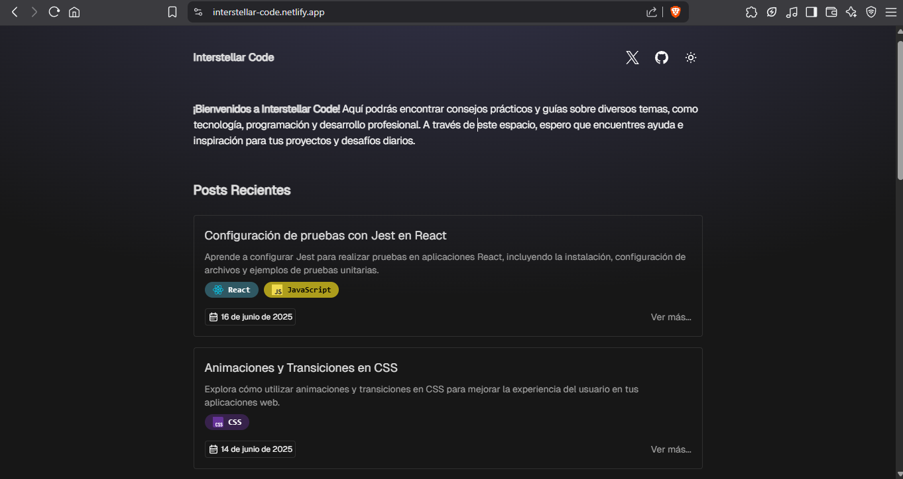
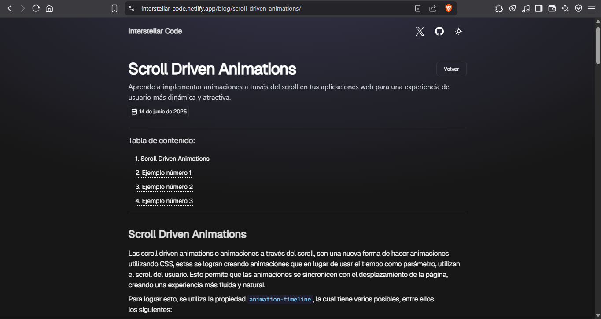

# Interstellar Code

<div style="width: 100%; display: flex; justify-content: center; margin-block: 1rem;">
  
</div>

**Interstellar Code** es un blog de desarrollo minimalista y moderno creado con el framework **Astro**. Está enfocado en compartir artículos sobre desarrollo web, programación, buenas prácticas, herramientas, frameworks y más temas tecnológicos de interés para programadores.

🔗 **Visítalo aquí:** [Interstellar Code](https://interstellar-code.netlify.app)

---

## 📸 Capturas de pantalla

### 🖥️ Página principal



### 📄 Página de artículo



---

## 🚀 Características

- ✅ Blog estático optimizado para una alta velocidad y rendimiento.
- ✅ Sistema de rutas automático con Astro.
- ✅ Astro content collections para facilitar la generación de artículos del blog con archivos MDX.
- ✅ Estilos modernos y responsive.
- ✅ Imágenes optimizadas y fuentes personalizadas.
- ✅ Deploy automático con Netlify.

---

## 🛠️ Tecnologías utilizadas

| Tecnología                               | Descripción                                        |
| ---------------------------------------- | -------------------------------------------------- |
| [Astro](https://astro.build/)            | Framework moderno para sitios rápidos y estáticos. |
| [Markdown/MDX](https://mdxjs.com/)       | Para escribir los artículos.                       |
| [Netlify](https://www.netlify.com/)      | Hosting y despliegue continuo.                     |
| [Tailwind CSS](https://tailwindcss.com/) | Para estilos rápidos y personalizables.            |

---

## 📦 Instalación local

```bash
# Clonar el repositorio
git clone https://github.com/chicho69-cesar/interstellar-code.git
cd interstellar-code

# Instalar dependencias
npm install

# Ejecutar en modo desarrollo
npm run dev
```

La aplicación estará disponible en <http://localhost:4321>

## 📂 Estructura del proyecto

```txt
interstellar-code/
│
├── public/             # Archivos públicos como imágenes
├── src/
│   ├── components/     # Componentes reutilizables
│   ├── content/        # Posts en formato mdx
│   ├── icons/          # Iconos utilizados en el proyecto
│   ├── layouts/        # Layouts base del sitio
│   ├── lib/            # Herramientas para el blog
│   ├── pages/          # Páginas y rutas del blog
│   ├── styles/         # Archivos CSS o Tailwind
├── astro.config.mjs    # Configuración principal de Astro
└── package.json        # Dependencias y scripts
```

## 🤝 Contribuciones

¿Quieres contribuir con ideas o mejoras? ¡Bienvenido! Puedes:

- Hacer un fork del proyecto.
- Crear una nueva rama (`git checkout -b feature/nueva-funcionalidad`).
- Hacer tus cambios.
- Crear un pull request.
